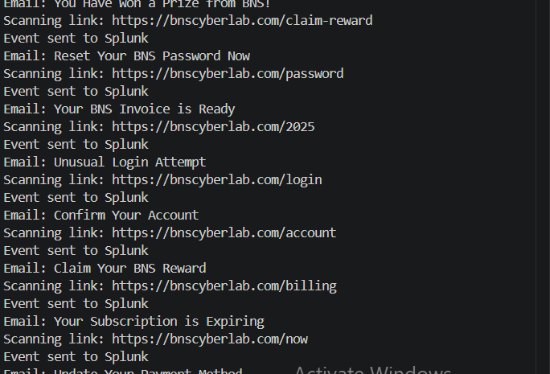
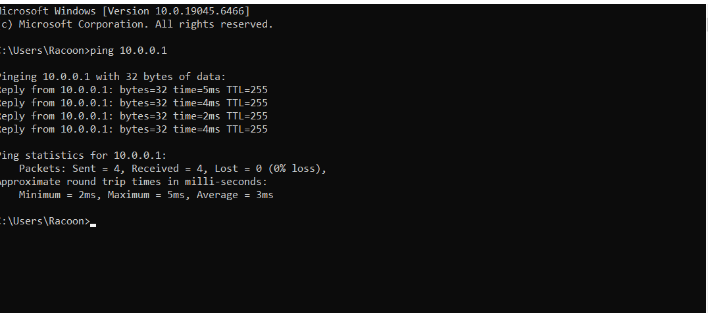
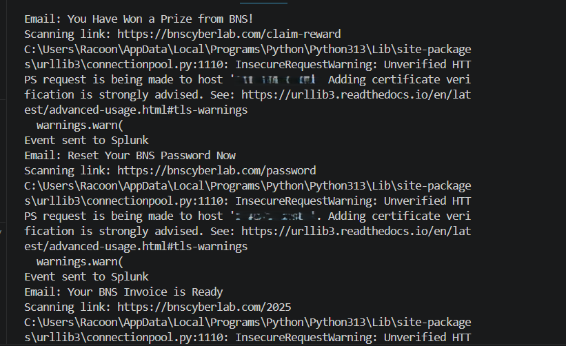
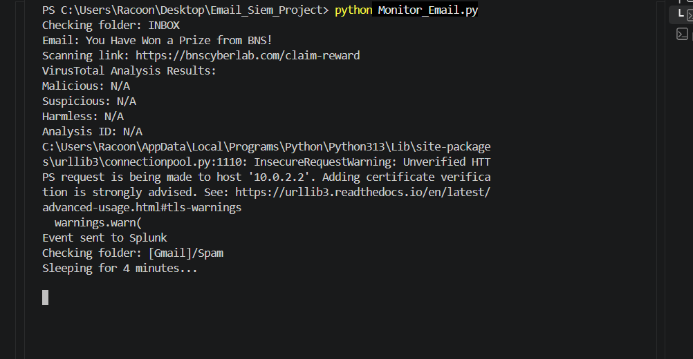
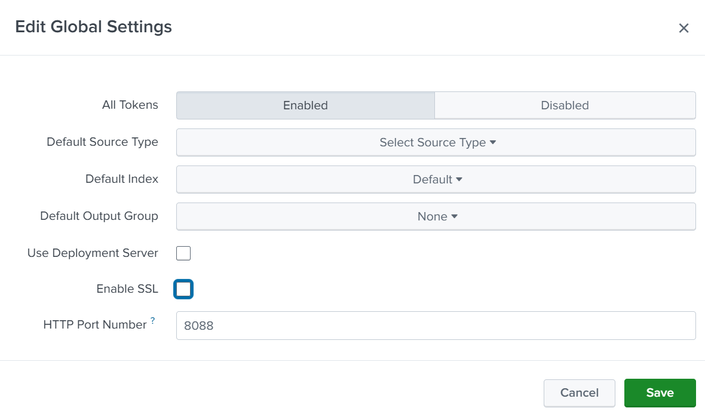
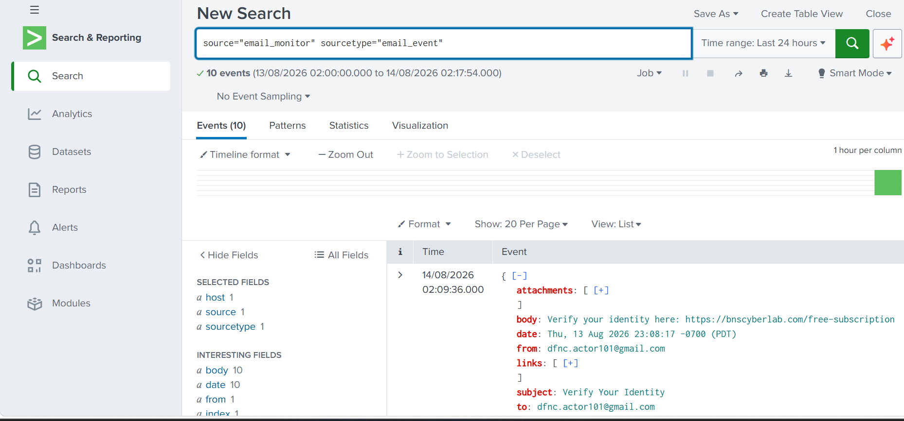

# Email SIEM Automation & Splunk Integration

## Overview

I built this project to understand how an automated email-monitoring workflow can feed security events into a SIEM.

The workflow connects:


The Python components run inside a Windows 10 VirtualBox VM, while Splunk Enterprise runs on the host machine.

This project also gave me hands-on experience with VM networking, HTTPS/TLS, Splunk HEC, event ingestion, and SPL searches.

---

## Tools & Technologies

| Tool | Purpose |
|---|---|
| Python | Email monitoring and automation |
| Gmail | Email source |
| Splunk Enterprise | SIEM |
| Splunk HTTP Event Collector (HEC) | Event ingestion |
| VirtualBox | Virtualization |
| Windows 10 | Python environment |
| VS Code | Development |
| VirusTotal API | URL analysis |

---

## Project Architecture

```text
Gmail
  │
  ▼
Monitor_Email.py
  │
  ├── Email monitoring
  ├── Email parsing
  ├── Metadata extraction
  └── URL extraction / analysis
  │
  ▼
Splunk HTTP Event Collector
  │
  ▼
Splunk Enterprise
  │
  ▼
SPL Search & Analysis
```

---

## 1. Test Email Generation

I created controlled test emails using `Send_Email.py` to provide data for the monitoring workflow.

.png)
---

## 2. Email Monitoring

`Monitor_Email.py` monitors the configured mailbox, processes incoming messages, extracts relevant email and URL information, and forwards the resulting events to Splunk.


...

## 3. VM-to-Host Connectivity

The Python environment was running inside my Windows 10 VM while Splunk Enterprise was running on the host machine.

Initially, the configuration used `localhost`, which refers to the VM itself. I changed the configuration to use the host machine's reachable IP address and verified connectivity from the VM.

The connectivity test below shows successful communication with the host at `10.0.0.1`, with 4 packets received and 0% packet loss.



---

## 4. URL Extraction & Analysis

The monitoring script extracts URLs from incoming email messages for further analysis. Each detected link is displayed in the terminal alongside the corresponding email subject, demonstrating the script's ability to identify and isolate potentially suspicious URLs from email content.

The extracted URLs are then processed as part of the monitoring workflow, with the resulting events forwarded to Splunk for centralized security monitoring and analysis.



---

## 5. VirusTotal Analysis and Splunk Integration

The monitoring script successfully detected a test email, extracted the embedded URL, and submitted it for VirusTotal analysis.

The email event was then successfully sent to Splunk for security monitoring and analysis.



**Observed Results:**
- Email successfully detected
- URL successfully extracted
- VirusTotal analysis executed
- Event successfully sent to Splunk
- INBOX and `[Gmail]/Spam` folders monitored


## 6. Splunk HEC Integration

The monitoring process was integrated with Splunk using the **HTTP Event Collector (HEC)**. Splunk HEC was enabled and configured to receive HTTP event data on port **8088**.

For this lab environment, **SSL was disabled** to allow the monitoring process to communicate with the Splunk HEC endpoint over HTTP and resolve connectivity issues encountered during testing.

> **Note:** In a production environment, HTTPS/TLS would be preferred to protect event data in transit.



---

## 7. Splunk Event Verification
The Splunk search confirmed that the email-monitoring events were successfully received and indexed. The search returned **10 events**, confirming that the processed email data was successfully transmitted through Splunk HEC and was available for analysis.



``

## Fial Workflow


    Test/Threat Email
            ↓
    Gmail Inbox
            ↓
    Monitor_Email.py
            ↓
    Email & URL Extraction
            ↓
    VirusTotal URL Analysis
            ↓
    Splunk HEC
            ↓
    Splunk Enterprise
            ↓
    SPL Search / Event Verification
            ↓
    Security Analysis

   ``


## Key Takeaways

- Built a Python-based email monitoring workflow.
- Extracted email content and URLs for security analysis.
- Used VirusTotal to analyze extracted URLs.
- Integrated Python with Splunk using HTTP Event Collector (HEC).
- Worked with VM-to-host networking and connectivity troubleshooting.
- Used SPL searches to locate and verify ingested security events.
- Troubleshot Splunk HEC connectivity and SSL certificate configuration issues.
- Validated the end-to-end email security monitoring pipeline.

---

## Security Considerations

Sensitive credentials and API keys were stored in `.env` rather than directly in the Python scripts.

The local Splunk instance used a self-signed certificate which caused certificate verification issue during testing. In the controlled laboratory environment, certificate verification was temporarily disabled using `verify=False` while troubleshooting the HEC connection

For a production environment, certificate verification should remain enabled and the appropriate trusted CA certificate should be configured.

---

## Project Structure

```text

email-siem-project/
│
├── README.md
├── Send_Email.py
├── Monitor_Email.py
├── .gitignore
│
└── screenshots/
    ├── 01-test-threat-email.png
    ├── 02-email-monitoring.png
    ├── 03-vm-to-host-connectivity.png
    ├── 04-email-url-extraction.png
    ├── 05-virustotal-url-analysis.png
    ├── 06-splunk-hec-integration.png
    └── 07-splunk-event-verification.png
```

---

## Project Status

**Completed and successfully tested.**
